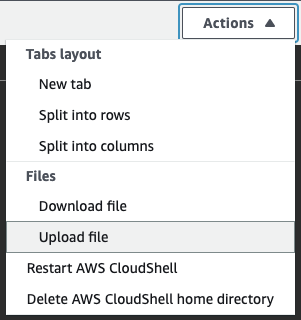
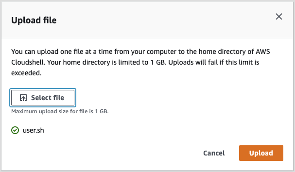
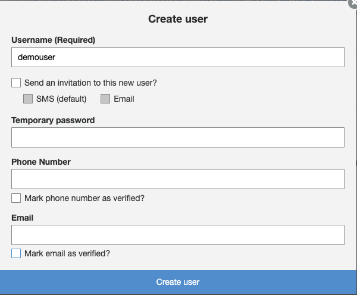
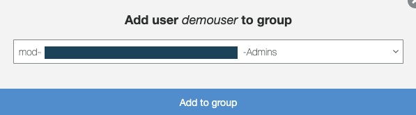

# Account Access
In this section, we will access your temporary AWS account where you will run your labs.

`WARNING: Follow the instructions given by the workshop administrators on how to log in to the AWS account provided for this workshop. Do NOT use your personal or business account to run this workshop, as the required pre-built resources will not be available.`

Once you are logged in, you will run an initialization script that will create required access to some of the solutions.

## Steps
### Event Engine access
1. Review [pre-requisites](https://catalog.us-east-1.prod.workshops.aws/v2/workshops/f3a3e2bd-e1d5-49de-b8e6-dac361842e76/en-US/preparation-guide)
1. Follow all the steps in [Start with an AWS EventEngine](https://catalog.us-east-1.prod.workshops.aws/v2/workshops/f3a3e2bd-e1d5-49de-b8e6-dac361842e76/en-US/preparation-guide/20-event-engine) module. Use your work email address that was used for event registration.
1. Select **Asia Pacific (Sydney) ap-southeast-2** in [Additional settings](https://catalog.us-east-1.prod.workshops.aws/v2/workshops/f3a3e2bd-e1d5-49de-b8e6-dac361842e76/en-US/preparation-guide/30-addition-setting)

### Initialization
**Script**
- Open [Cloudshell](https://ap-southeast-2.console.aws.amazon.com/cloudshell/home?region=ap-southeast-2#)
- On the right side, click open the *Actions* drop-down menu,   
- Upload the [user.sh](./user.sh) file from this folder   
- Once uploaded run the below commnd 
> chmod +x user.sh ; ./user.sh

**Manual Option** 

`If you are unable to execute the initialization script`, follow below steps
- Navigate the [Cognito User Pools](https://ap-southeast-2.console.aws.amazon.com/cognito/users/?region=ap-southeast-2#/)
- Open the user pool with name *ContentAnalysisUserPool-XXXXXXXX*
- Under *General Serttings* > *Users and Groups* click on *Create User* button.
- Enter *username* as *demouser* and unselect all other options and click *Create User* button   
- You will see a new user is created with username *demouser*
- Click open the *demo user*
- Click on *Add to group*
- Select the only group that ends with *Admin*   
- You should now be able to login to the content analysis UI.
