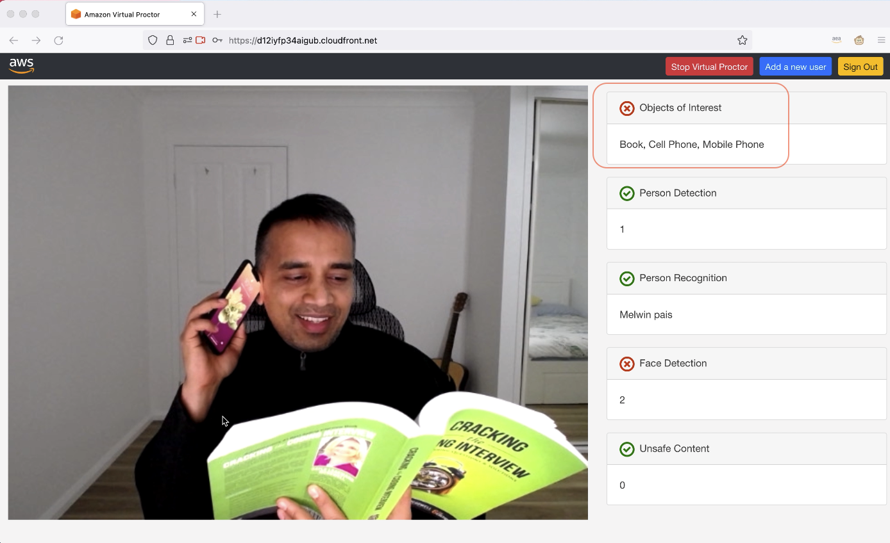

# Virtual Proctor using Amazon Rekognition

Proctoring is the act of supervising an exam or course online.

Using web-based applications, virtual proctoring platforms allow test takers to be virtually monitored by a human via the webcam on their computer. To increase the scale of the test taking and improve a human proctor’s ability to monitor students, virtual proctoring services are now implementing AI/ML to support the human proctor.

## What you will learn?
Virtual Proctor is a solution that leverages Amazon Rekognition to show a scalable way to conduct online testing.

It shows how you can implement rules such as:
- Detecting objects of interest (such as mobile phone)
- Detecting the number of people present
- Recognizing the person who is taking a test
- Detecting unsafe content (such as explicit adult content or violent content)
You can also use [Amazon Rekognition Custom Labels](https://aws.amazon.com/rekognition/custom-labels-features/) to detect other custom objects of interest.

**AI Services used**
- [Amazon Rekognition](https://aws.amazon.com/rekognition/)

## Steps
- Navigate to [Virtual Proctor](https://github.com/aws-samples/amazon-rekognition-virtual-proctor) solution.
- Under *Deployment* > Click on *Launch on AWS* button next to *Asia Pacific (Singapore) (ap-southeast-1)*   
- Under parameters, 
  - for *AdminEmail* enter your email address.
  - For *ObjectsOfInterestLabels* add *Book* and any other labels of interest.
- Follow all other steps as the guide to deploy the solution which takes about 5 minutes.
- Feel free to watch the [pre-recorded demo](https://www.youtube.com/watch?v=kKVLrslta6k) until the deployment finishes.
  - [0:00 - Introduction to Virtual Proctoring](https://www.youtube.com/watch?v=kKVLrslta6k)
  - [1:20 - Architecture](https://youtu.be/kKVLrslta6k?t=80)
  - [3:01 - Deploy using CloudFormation ](https://youtu.be/kKVLrslta6k?t=181)
  - [4:19 - Logging into the UI](https://youtu.be/kKVLrslta6k?t=259)
  - [5:16 - Adding a new User](https://youtu.be/kKVLrslta6k?t=316)
  - [5:52 - Testing](https://youtu.be/kKVLrslta6k?t=352)
- Test the solution with Chrome or Firefox browser.   

## Next Steps
The source code is available for your review and customizations. You can use the solution to build your own virtual proctoring solution.

The most common use-cases for Rekognition Image include:

- Searchable Image Library
- Face-Based User Verification
- Sentiment Analysis
- Facial Recognition
- Image Moderation

The most common use-cases for Rekognition Video include:
- Search Index for video archives
- Easy filtering of video for explicit and suggestive content

Speak to your AWS Account Manager if you wish to discuss your use case further.

## Resources
- Blog - [Using the cloud to support remote proctoring and assessment](https://aws.amazon.com/blogs/publicsector/using-cloud-support-remote-proctoring-assessment/)
- [Pre-recorded demo](https://www.youtube.com/watch?v=kKVLrslta6k)
- [Source code](https://github.com/aws-samples/amazon-rekognition-virtual-proctor)