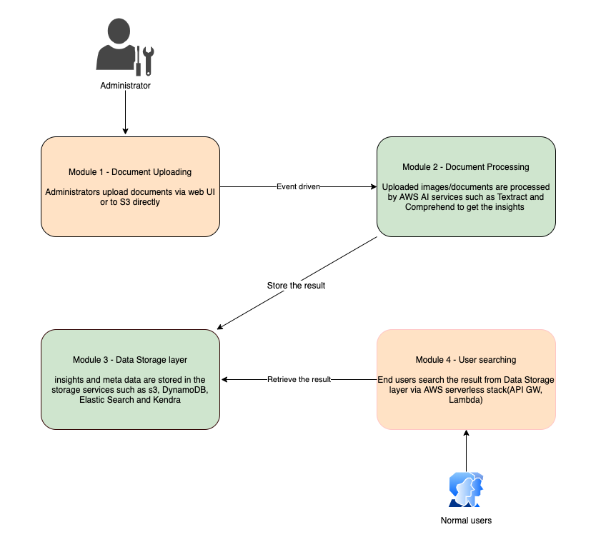
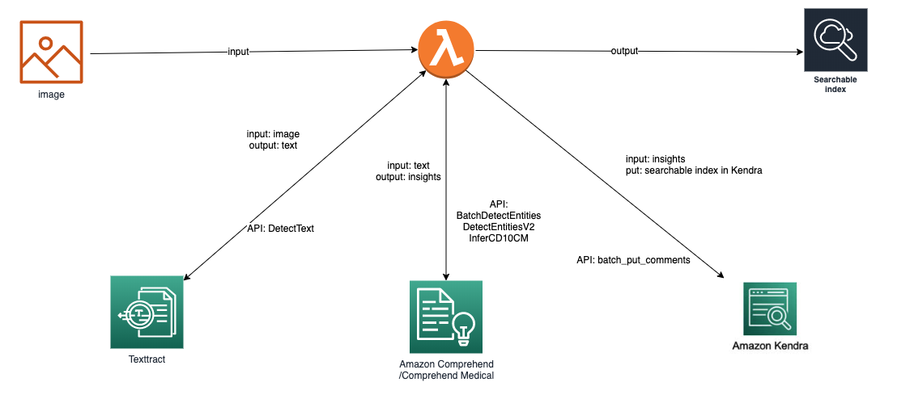

# Document Understanding Solution

`WARNING: As you are using a same (shared) website to test the solution, you are encouraged not to upload private, sensitive, or confidential information as it will be instantly visible to others. Please feel free to use any public artefacts. `

The Document Understanding Solution (DUS) delivers an easy-to-use web application that ingests and analyzes files, extracts text from documents, identifies structural data (tables, key value pairs), extracts critical information (entities), and creates smart search indexes from the data. Additionally, files can be uploaded directly to and analyzed files can be accessed from an Amazon Simple Storage Service (Amazon S3) bucket in your AWS account.

## What you will learn?
Using AWS artificial intelligence (AI) services, how to address business problems that apply to various industry verticals:
- Search and discovery: Search for information across multiple scanned documents, PDFs, and images
- Compliance: Redact information from documents
- Workflow automation: Easily plugs into your existing upstream and downstream applications 

## Solution overview

The Document Understanding Solution overview link is here [Solution](https://aws.amazon.com/solutions/implementations/document-understanding-solution/)

There are four main modules in the solution
- Module 1: Document Uploading
- Module 2: Document Processing
- Module 3: Data Storage Layer
- Module 4: User searching

## AI Services and Data flow in the solution

**AI Services used**
- [Amazon Textract](https://aws.amazon.com/textract/): Extract the text from image/pdf documents.
- [Amazon Comprehend](https://aws.amazon.com/comprehend/): Understand the meaning of text and uncover valuable insights from text
- [Amazon Comprehend - Medical](https://aws.amazon.com/comprehend/medical/)
- [Amazon Kendra](https://aws.amazon.com/kendra/): Provide intelligent search service powered by machine learning (ML).

## Steps
- Navigate to [Document Understanding Solution](https://d2l8l7ins1imlo.cloudfront.net/home) website.
- You can use *demouser* for shared access.
- For private access login with your registered *email address (replace @ with . )*  If your email is john.citizen@world.com the username is john.citizen.world.com
- Run the following test cases
  - Search for contextual question and compre results between OpenSearch and Kendra.
  - Upload a handwritten document and search for content
- sample documents
  - [Queens letter](https://www.bbc.com/news/uk-england-wiltshire-36122985)

## Next Steps
The source code is available for your review and customizations. You can use the solution to build your own PoC.

The most common use-cases for [Amazon Kendra](https://aws.amazon.com/kendra/) and [Amazon Textract](https://aws.amazon.com/textract/) include:

- Search and discovery: Search for information across multiple scanned documents, PDFs, and images
- Education administration of classes, registrations etc.
- Intelligent library artifacts search engine
- Compliance: Redact information from documents
- Workflow automation: Easily plugs into your existing upstream and downstream applications 

## Resources
- [Solution](https://aws.amazon.com/solutions/implementations/document-understanding-solution/)
- [Source code](https://github.com/awslabs/document-understanding-solution)
- [Tutorial - Extract text and structured data](https://aws.amazon.com/getting-started/hands-on/extract-text-with-amazon-textract/)
- [Textract FAQs](https://aws.amazon.com/textract/faqs/)
